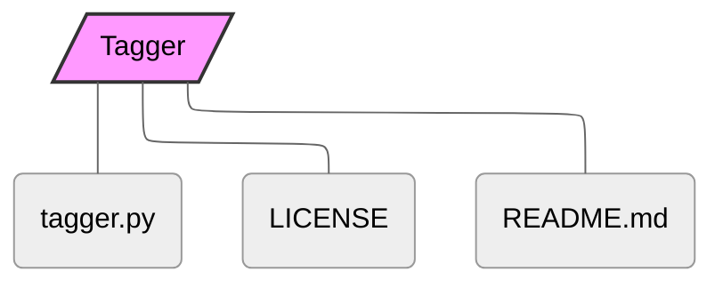

# Tagger
###### Isn't it sad that that Linux computers—unlike Macs—cannot add tags to files? Without tags, sorting and finding your files is much harder. Tagger is an extremely lightweight Python-based terminal tool, for very basic file/folder sorting; built specifically for Raspberry Pis.

--- 

## Usage

Tagger has a subcommand system, making it intuitive to use, and much more similar to spoken language than using flags:
```bash
$ tagger list tag Home
$ tagger rename Home "Home and Work"
$ tagger tag example.txt "Home and Work"
```

---

## Files

```
.
├── src/
│   ├── main.py
│   └── utils.py
├── LICENSE
└── README.md
```


